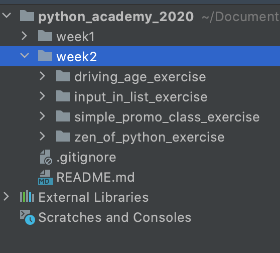

# WEEK 2 : Mocks and Classes

## Project Structure


#### Exercise 1: Calculate whether a person is able to drive or not
The folder driving_age_exercise contains the following files for accomplishing the requisites:
  - main.py: File for instantiating some objects and storing them in file.
  - people_register.pckl : Persistance file for storing some objects
  - Person.py : Class for specifying the main attributes for a person also known as a driver
  - Register.py : Class for saving a loading data from files.
  - TestUsersAge.py : Class for executing the unit Tests


#### Exercise 2: Using the "input" built-in see if it matches items within a list
The folder input_in_list_exercise contains the following files for accomplishing the requisites:
  - Colors.py : Class containing the logic for developing the exercise requisites
  - ColorTest.py : Class for mocking the Color class and executing validations over it. 
  
#### Exercise 3: Loop over the characters in the large block of text
Zen_of_python_exercise contains the following files for accomplishing the requisites:
  - main.py : File containing the methods for replacing the vowels for stars and counting the number of replacements.

The exercise produced the following chain
```
 *lth**gh th*t w*y m*y n*t b* *bv***s *t f*rst *nl*ss y**'r* D*tch.
 N*w *s b*tt*r th*n n*v*r.
 *lth**gh n*v*r *s *ft*n b*tt*r th*n *r*ght* n*w.
 *f th* *mpl*m*nt*t**n *s h*rd t* *xpl**n, *t's * b*d *d**.
 *f th* *mpl*m*nt*t**n *s **sy t* *xpl**n, *t m*y b* * g**d *d**.
 N*m*sp*c*s *r* *n* h*nk*ng gr**t *d** -- l*t's d* m*r* *f th*s*!
 
Counter of Vowels: 264
```
#### Exercise 4: Write a simple Promo class.
simple_promo_class_exercise contains the following files for accomplishing the requisites:
- Promo.py : Class for containing attributes as the product name, the expiration date and some general methods for handling the data.
- promopersistance.pckl : File for storing the Promo objects 
- PromoRegisters.py : Class for addressing the data in persistance
- PromoTest.py : Class for executing some mocking tests over the Promo Class. 


