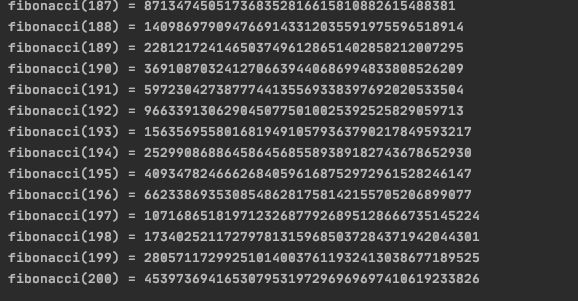

## Exercise 1 

#### Memoization Case Fibonacci: Using this function as base:
``` def fibonacci(n):
if n < 2:
return 1
else:
return fibonacci(n-1) + fibonacci(n-2)
```
### Write a decorator to cache function invocation results to memoize it. Store pairs arg:result in a dictionary in an attribute of the function object.

A wrapper storing the values and results dictionary was created and got the following results


