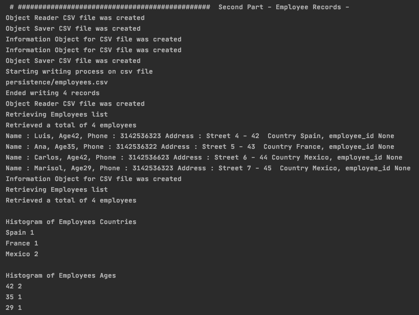

# WRAPPER, GENERATORS AND LOGGER - WEEK 3 EXERCISE

### Create a wrapper to mask the implementation of a CSV File Reader, it can read, save, and
### return the information of the file, you can try it creating a CSV File with Employee Information:
### Name, Phone, Address, Country with random information.

The Facade Pattern was followed by creating a manager in charge of handling the different CSV requests:
  - ReaderCSV
  - SaverCSV
  - InformCSV

And the wrappers were added in order to manage the data. 

 
