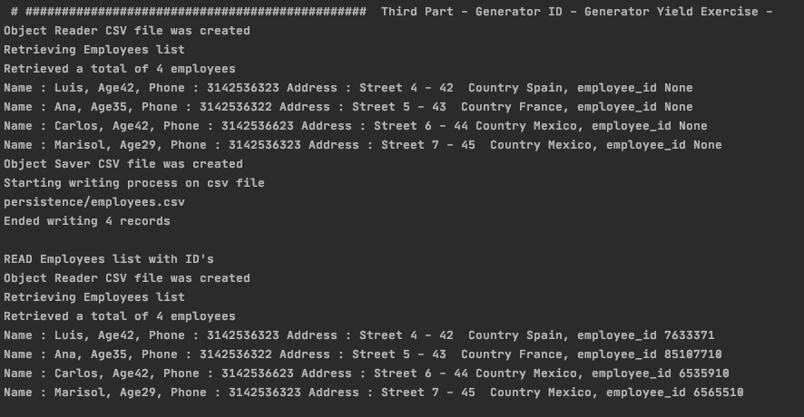
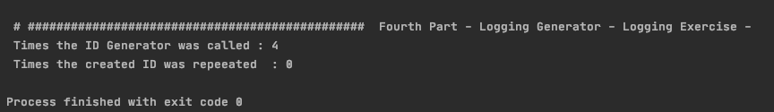
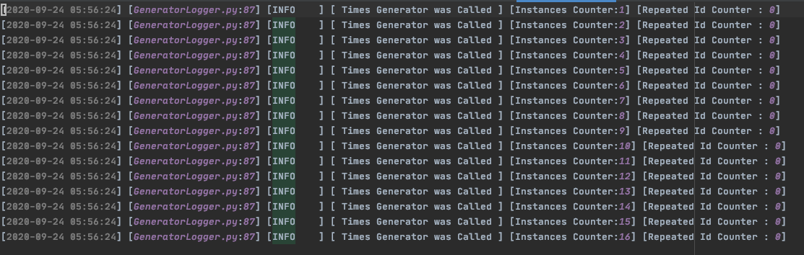

# WRAPPER, GENERATORS AND LOGGER - WEEK 3 EXERCISE

### Create a wrapper to mask the implementation of a CSV File Reader, it can read, save, and
### return the information of the file, you can try it creating a CSV File with Employee Information:
### Name, Phone, Address, Country with random information.

The Facade Pattern was followed by creating a manager in charge of handling the different CSV requests:
  - ReaderCSV
  - SaverCSV
  - InformCSV

And the wrappers were added in order to manage the data. 

Finally we used InformCSV methods to get measures over the Employees population in between age and origin histograms.

### In the CSV created above, create a new column called Employee ID, fill this column with a
### unique ID combination of two numbers.
### Tip: Create a Generator who construct this info. Maintain a Cache on generator to know if the
### generated ID is used already
 
The new Column ID was filled with the ID employee generator by caching the records to avoid id's repetition
idGenerator class is in charge of handling these details.

Note : I was not sure on how to create an attribute dynamically to the Employee class. 
I'll search for it and correct it in future.

### Create a Logging Class for generator, write a log with the number of times the generator is
### been called and how many times the Id is repeated.
### Tip: To do the Logger class you can use the Singleton or an observer pattern.

A singleton class was implemented in charge of storing the instances and Id's records. As it's 
not likely to get the repeated id sequence, it always shows zero, but it works! Believe, beeeelieve

