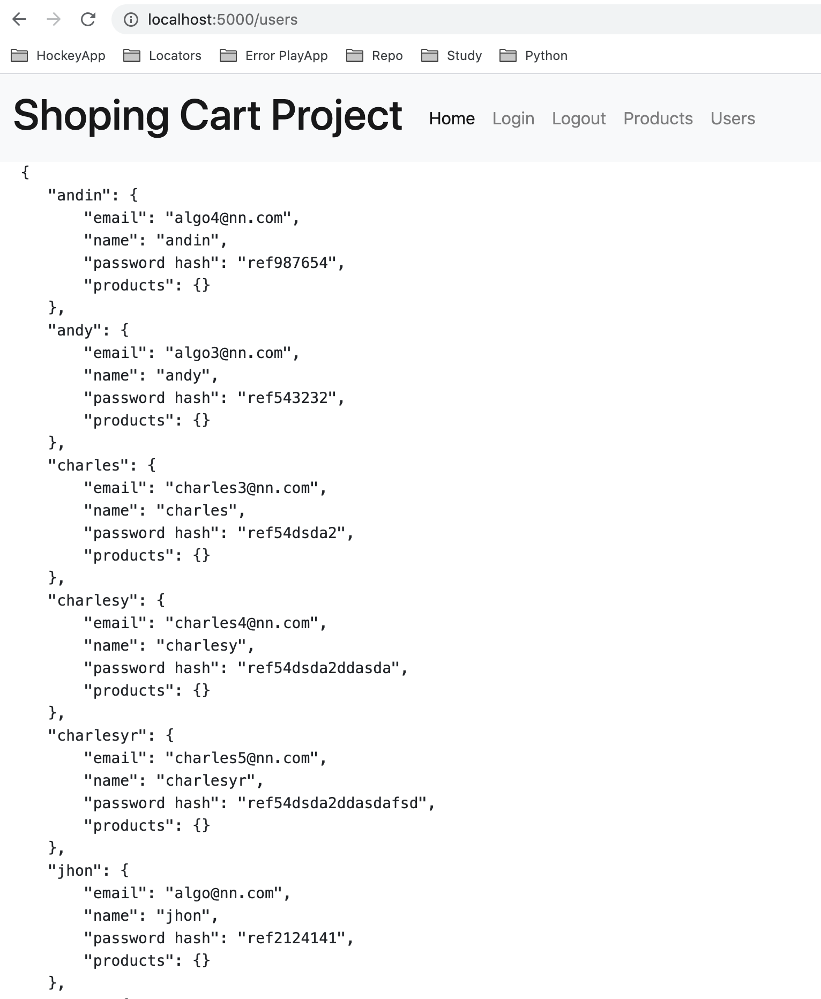
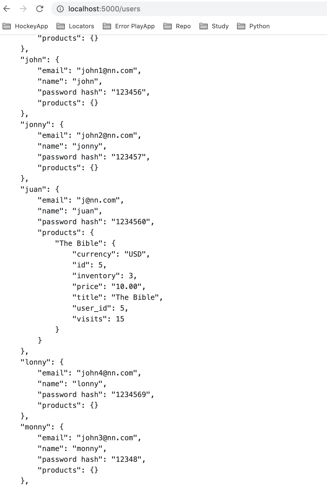
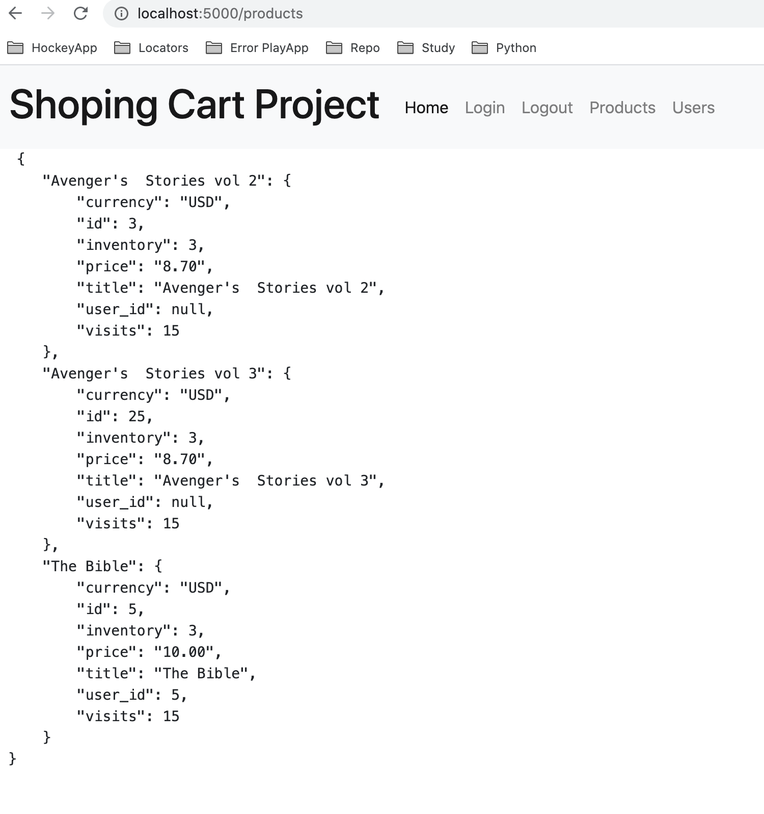

# Shoping Cart Base
## This is the root app to start the project, is mounted on Python 3.7 with cutting edge Flask, Flask-alchemy and Flasks Migrations.

## Project Composition : 
#### The Front is based on BootStrap components and backend is mainly based on Flask. No time for Django. In overall,we have the following components:

- DB
- Functional Flask endpoints
- Bootstrap for the Front

#### Flask Backend plus Sql DB for users and products. 


#### User is able to store products! 



#### Also products table is able to store one user as the relation one-to-one was specified 



#### The front also has the logic for validating the user, validating if it's a valid user and also storing user credentials under the browser session.

## What's missing?
 ### - JWT for flask
 ### - Django endpoints
 ### - JWt for Django. 

## Notes: 
#### I deleted the Alembic table inside SQLAlchemy, so versions tracking dissapeared. This was not intentional. It was just tricky to update table names in Alembic and didn't know how to correct it until it was too late. But's it's also functional :D

#### I don't remember any other Issue beesides the "circular import until infinite", "the not finding the venv location" thing and also the relative imports. For the latter I didn't find a simple import tag compatible among the Intellij app and the docker execution. 
 


This App is mounted on Docker and Docker Compose, to run it please run:

```
docker-compose up
```

It will take the changes on the code and reload the container with the new ones

To install the packages locally first install pipenv
```
pip install pipenv
```
And then run 
```
pipenv install
```

## TO Create Tables on DB
Right now this projects has a SQLLite DB, pointing to **/api/data/app.db** 
To change the file or perform an init of the migrations use
```
flask db init
```
To perform a migration
of new tables please use
```
flask db migrate -m "model table"
```
Then:
```
flask db upgrade
```
